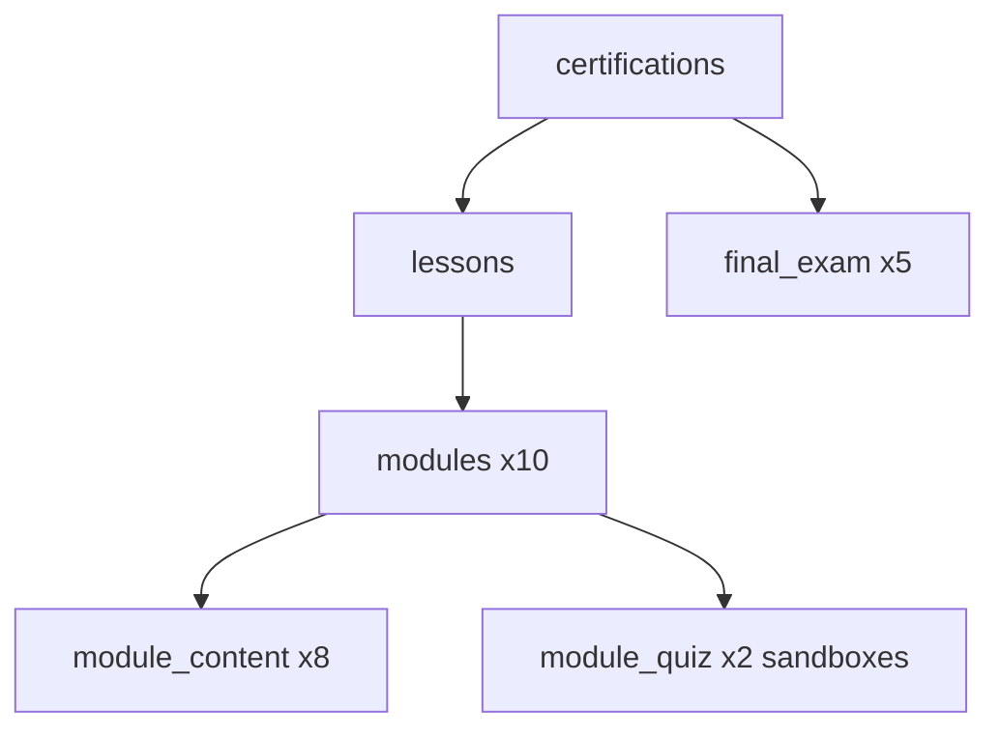
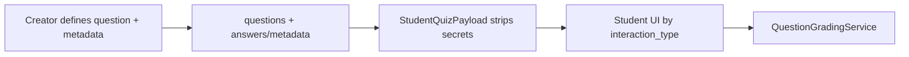
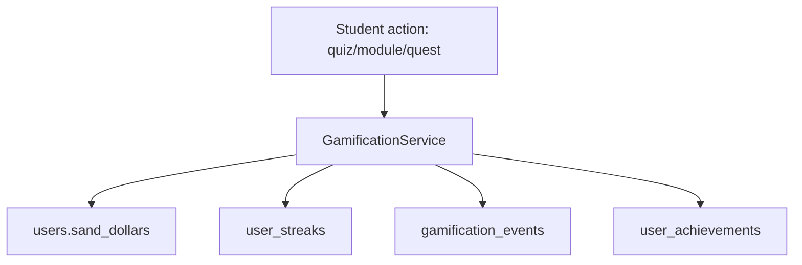
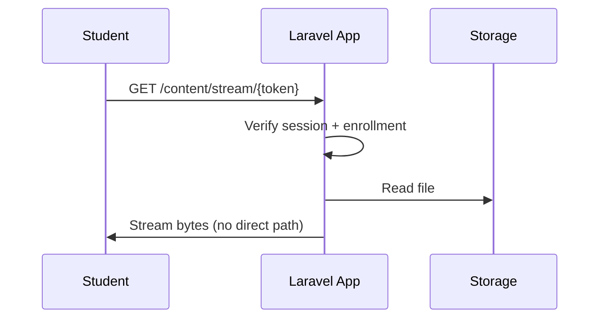
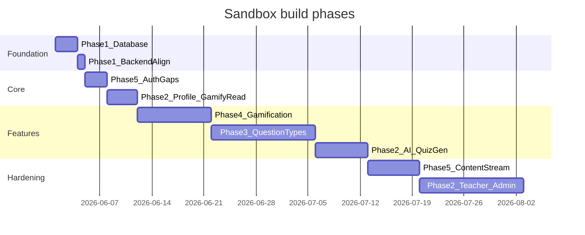

## Phase 0: Pinned master guide (deliverable)

Create **[`docs/SANDBOX_MASTER_PLAN.md`](docs/SANDBOX_MASTER_PLAN.md)** as the single source of truth. It will mirror this plan with:

- Architecture diagrams (cert hierarchy, gamification loop, content delivery)
- Per-phase checklists with file paths and acceptance criteria
- Mock/stub inventory (copied from audit below)
- Schema migration changelog
- Security threat model + mitigations (with explicit browser limitations)
- Design-system references ([`resources/css/sandbox-admin.css`](resources/css/sandbox-admin.css), [`resources/css/sandbox-student.css`](resources/css/sandbox-student.css), [`resources/css/sandbox-creator.css`](resources/css/sandbox-creator.css))
- Replace / supersede stale sections in [`Sandbox Documentation.txt`](Sandbox Documentation.txt) with a link to the new doc

---

## Phase 1: Database recreation (certifications only)

**Goal:** Drop and recreate all four published shells so each meets **creator UI minimums** (aligned with [`Edit.jsx`](resources/js/Pages/Creator/Certifications/Edit.jsx)):

| Requirement | Value |
|-------------|-------|
| Total sandboxes (modules) | ≥ 10 |
| Quiz-only sandboxes | ≥ 2 (0 `module_content`, ≥ 5 `module_quiz` questions each) |
| Final exam | ≥ 5 questions, 4 answers each, 1 correct |
| Per sandbox | ≥ 1 component (file **or** practice quiz) |
| Metadata | title, description, category, difficulty, estimated_duration, thumbnail, price |

**Canonical template:** Use **FULL DEMO (cert id 1)** in [`database/sandbox_full_restore.sql`](database/sandbox_full_restore.sql) as the structural template (10 modules, 2 quiz-only at modules 103/107, 5 exam Qs).



**Files to update (keep in sync):**

- [`database/sandbox_full_restore.sql`](database/sandbox_full_restore.sql) — primary restore via `php artisan db:restore-playtest`
- [`database/student_playtest_seed.sql`](database/student_playtest_seed.sql) — content-only re-seed

**Per-cert work (REACT #2, JAVA #3, LARAVEL #4):**

- Add **5 new modules** each (currently 5 → 10)
- Add `module_content` for new content sandboxes (minimal: `youtube_embed` like existing seeds)
- Preserve existing 2 quiz-only sandboxes (203/205, 303/305, 403/405) — already valid
- Keep 5 final exam questions (already valid)
- Keep covers under `storage/app/public/shell-covers/` (incl. `Cursor-Intro.jpg` for Cursor IDE Master if applicable)
- Run `certifications:sync-themes` after import (already in [`RestorePlaytestDatabase.php`](app/Console/Commands/RestorePlaytestDatabase.php))

**Backend alignment (same phase):**

Update [`CertificationService.php`](app/Services/CertificationService.php) submit validation to match frontend:

- ≥ 10 modules, ≥ 2 quiz-only sandboxes, per-module component rules, ≥ 5 exam questions

This prevents UI/backend drift that blocked realistic submit testing.

**Verification:** `php artisan db:restore-playtest` → each cert has 10 modules / 2 quiz-only / 5 exam Qs; creator Edit checklist all green for FULL DEMO + expanded shells.

---

## Phase 2: Mock / dummy audit and backend wiring backlog

### Content creator

| Surface | Status | Wire to |
|---------|--------|---------|
| [`GenerateQuizModal.jsx`](resources/js/Components/Creator/GenerateQuizModal.jsx) / [`CreatorGeminiPanel.jsx`](resources/js/Components/Creator/CreatorGeminiPanel.jsx) | **Working** | [`GeminiController`](app/Http/Controllers/Creator/GeminiController.php), sequential file synthesis |
| Shell CRUD, modules, content, manual quiz/exam | **Working** | Existing creator controllers |
| Wallet / Auditor | **Working** | Existing controllers |
| Review assistant KB | **Working** | [`CertificationKnowledgeBuilder`](app/Services/Ai/CertificationKnowledgeBuilder.php) on final exam save + submit gate |

### Admin

| Surface | Status | Wire to |
|---------|--------|---------|
| [`Finance/Index.jsx`](resources/js/Pages/Admin/Finance/Index.jsx) | **Working** (ledger, withdrawals, webhooks live) | [`FinanceController`](app/Http/Controllers/Admin/FinanceController.php), [`WithdrawalController`](app/Http/Controllers/Admin/WithdrawalController.php) |
| [`Dashboard.jsx`](resources/js/Pages/Admin/Dashboard.jsx) charts | **Working** | [`AdminDashboardController`](app/Http/Controllers/Admin/AdminDashboardController.php) enrollment/role/revenue aggregates |
| [`Users/Index.jsx`](resources/js/Pages/Admin/Users/Index.jsx) suspend/archive/show | **Working** | [`UserManagementController`](app/Http/Controllers/Admin/UserManagementController.php) |
| [`AuditLogs/Index.jsx`](resources/js/Pages/Admin/AuditLogs/Index.jsx) | **Working** (live when table populated) | [`AuditLogController`](app/Http/Controllers/Admin/AuditLogController.php) |
| Cert archive/restore | **Working** | [`CertificationApprovalController`](app/Http/Controllers/Admin/CertificationApprovalController.php) |

### Teacher

| Surface | Status | Wire to |
|---------|-------------|---------|
| Dashboard, shells, batch, purchase history | **Working** | [`TeacherShellController`](app/Http/Controllers/Teacher/TeacherShellController.php), [`CohortBatchAnalyticsService`](app/Services/Teacher/CohortBatchAnalyticsService.php) |
| Bulk checkout | **Working** | Enrollment requests + Xendit + vouchers |
| Voucher email | **Working** | [`VoucherController`](app/Http/Controllers/Teacher/VoucherController.php), [`VoucherInvitationMail`](app/Mail/VoucherInvitationMail.php) |
| `HandleInertiaRequests` teacher summary | **Working** | Real cohort/voucher aggregates |

### Student

| Surface | Status | Wire to |
|---------|--------|---------|
| [`Leaderboard.jsx`](resources/js/Pages/Student/Leaderboard.jsx) | **Working** | [`LeaderboardController`](app/Http/Controllers/Student/LeaderboardController.php) + [`GamificationService`](app/Services/GamificationService.php) |
| [`MyCast.jsx`](resources/js/Pages/Student/MyCast.jsx) | **Working** | [`CastController`](app/Http/Controllers/Student/CastController.php) + [`CastService`](app/Services/Student/CastService.php) |
| Dashboard (no enrollment) | **Working** | Empty state + marketplace CTA |
| `HandleInertiaRequests` `studentGamification` | **Working** | Real DB reads via [`GamificationService`](app/Services/GamificationService.php) |
| **Review AI assistant** | **Working** | [`StudentReviewAssistantController`](app/Http/Controllers/Student/StudentReviewAssistantController.php) + cached KB |
| Shop diagnostic | **Stub** | Diagnostic pre-assessment flow (future) |

### Shared

| Surface | Status | Wire to |
|---------|--------|---------|
| [`ProfileController.php`](app/Http/Controllers/ProfileController.php) | **Working** | `profile.update`, `password.update`, `profile.destroy` |
| [`AcceptInvite.jsx`](resources/js/Pages/Auth/AcceptInvite.jsx) affiliation docs | **Stub** | Document upload step (future) |
| [`routes/api.php`](routes/api.php) | Sanctum stubs | Defer or implement as needed |

### AI integration (completed)

1. **PDF → quiz generation** — Gemini sequential synthesis + question generation
2. **AI complete-the-code** / **true_false_ai** grading — [`GeminiGradingService`](app/Services/Ai/GeminiGradingService.php)
3. **Review assistant chatbot** — certification knowledge base + student chat panel

---

## Phase 3: New question types — schema and UX

Extend `questions.question_type` ENUM (via migration) and add structured payload storage.

**Recommended schema addition:**

```sql
-- questions table additions
interaction_type ENUM('multiple_choice','true_false','true_false_ai','matching','sequence','code_complete') 
metadata JSON NULL  -- type-specific config (pairs, sequence, code template, AI rubric)
```

Keep `answers` for MC/TF; use `metadata` for non-MC types.

### 3.1 AI complete-the-code

**Creator inputs:** starter code (optional), expected stdout/output, language, optional test cases, points.

**Student UX:** Code editor (reuse admin `input-field` styling + monospace block); run/submit triggers server-side check.

**Grading:** Server executes in sandboxed runner (Docker/firejail) **or** AI compares output + semantic equivalence; never trust client.

**Files:** Creator editor in [`Edit.jsx`](resources/js/Pages/Creator/Certifications/Edit.jsx) / new `QuestionTypeEditor` components; student in [`StudentSandboxQuiz.jsx`](resources/js/Components/Student/StudentSandboxQuiz.jsx); `CodeGradingService`.

### 3.2 Drag-and-drop matching

**Creator inputs:** N pairs (left label ↔ right label).

**Student UX:** Jumbled right column; drag to match (use existing student card/chunky styling from [`sandbox-student.css`](resources/css/sandbox-student.css)).

**Grading:** Compare pair mapping server-side; partial credit optional.

**metadata shape:** `{ pairs: [{ id, left, right }] }`

### 3.3 Fix the sequence

**Creator inputs:** Ordered list of items (correct sequence).

**Student UX:** Jumbled list, drag to reorder (same DnD kit as matching).

**Grading:** Exact order or Kendall-tau partial credit.

**metadata shape:** `{ items: [{ id, text }], correct_order: [id,...] }`

### 3.4 True / False (basic)

**Creator:** Single statement + correct boolean.

**Student:** Two large buttons (True / False) — match student quiz button patterns.

**Grading:** Server compares boolean; store in `answers` as two options or `metadata.correct: true|false`.

### 3.5 Modified True / False (AI)

**Creator:** Statement shown to student is **false**; stores `reference_true_statement` (what a correct answer should convey).

**Student:** Free-text explanation.

**Grading:** AI similarity against reference (embedding + LLM judge); threshold configurable; fallback to manual review queue.

**Design:** Use [`AdminModal`](resources/js/Components/Admin/AdminModal.jsx) for creator preview; student uses existing quiz flow shell.

### Shared implementation notes

- Extend [`StoreQuestionsRequest.php`](app/Http/Requests/Creator/StoreQuestionsRequest.php) with type-specific validation
- Extend [`StudentQuizPayload.php`](app/Support/StudentQuizPayload.php) to strip all grading keys
- Extend [`QuizService.php`](app/Services/QuizService.php) / new `QuestionGradingService` with strategy per type
- Creator UI: new question-type picker in quiz/exam modals (admin form components: `admin-field`, `admin-card`)



---

## Phase 4: Gamification — sand dollars, streaks, quests, leaderboard

**Reference models:** Duolingo (streaks, daily goals, XP), Gizmo (session goals), Coursera (certificates — already partial).

### 4.1 Core economy

| Mechanic | Current | Target |
|----------|---------|--------|
| Sand dollars earn | Quiz pass: 50/30/10 in [`QuizController`](app/Http/Controllers/Student/QuizController.php) | Central `GamificationService::award()` with event log |
| Sand dollars display | Mock 1250 in [`HandleInertiaRequests.php`](app/Http/Middleware/HandleInertiaRequests.php) | Read `users.sand_dollars` |
| Spend | None | Cosmetics shop, streak freezes, fast-track retries |
| `questions.points` | Unused | Weight SD by question points |

**New tables:**

- `gamification_events` — user_id, event_type, amount, source_id, created_at
- `achievements` + `user_achievements` — badge definitions + unlocks
- `daily_quests` + `user_daily_quest_progress` — 3 rotating quests/day

### 4.2 Streaks

- Use existing [`user_streaks`](database/sandbox_full_restore.sql) table
- Update on: module complete, quiz attempt, daily quest claim
- Rules: 1 qualifying action/day; streak freeze item (cosmetic shop); timezone from user profile
- UI: already in [`StudentProfilePanel.jsx`](resources/js/Components/Student/StudentProfilePanel.jsx) — wire real data

### 4.3 Daily quests (Duolingo-style)

Example quest pool:

- Complete 1 sandbox module
- Pass 1 quiz with ≥ 80%
- Earn 30 sand dollars today
- Maintain streak (auto-complete if streak updated)

Reset at local midnight; show on student dashboard sidebar.

### 4.4 Leaderboard

Replace [`StudentLeaderboardMockData.php`](app/Support/Mocks/StudentLeaderboardMockData.php):

- Weekly + all-time tabs (UI already has period toggle)
- Rank by: sand_dollars, completed_sandboxes, streak_days
- Scope: global or per-certification (optional phase 2)
- Wire [`LeaderboardController.php`](app/Http/Controllers/Student/LeaderboardController.php)

### 4.5 Achievements / badges

Replace hardcoded 3 badges in middleware with DB-driven achievements:

- First sandbox complete, 7-day streak, perfect quiz, cert earned, etc.
- Display in profile panel + optional toast (reuse [`creator-toast`](resources/css/sandbox-creator.css) patterns on student theme)

### 4.6 Cosmetics shop (Hermy)

Wire empty controllers:

- [`ShopController.php`](app/Http/Controllers/Student/ShopController.php), [`HermyController.php`](app/Http/Controllers/Student/HermyController.php)
- Purchase with sand dollars → `user_cosmetics`; equip → `equipped_cosmetics`
- UI: extend student shop/nav using existing student card components



---

## Phase 5: Security and content protection

**Reality check (document explicitly in guide):** Browser-based apps **cannot fully prevent** DevTools inspection, network tab URLs, screenshots, or screen recording. Goal is **defense in depth** like Coursera/Vimeo: raise cost of abuse without breaking UX.

### 5.1 Session and authorization (fix gaps first)

| Route | Fix |
|-------|-----|
| [`QuizController@submit/check`](app/Http/Controllers/Student/QuizController.php) | Require enrollment for cert owning module |
| [`ExamController@submit`](app/Http/Controllers/Student/ExamController.php) | Require enrollment (check exists on `check` only) |
| [`MyShellController@completeModule`](app/Http/Controllers/Student/MyShellController.php) | Require enrollment + module belongs to cert |
| [`CheckRole.php`](app/Http/Middleware/CheckRole.php) | Also verify `is_active`; optional session re-validation |

Add reusable `EnsureEnrolledInCertification` middleware.

**Every page load:** Inertia controllers verify enrollment/cert ownership before returning module lists, questions, or file references.

### 5.2 Content delivery (replace public `/storage` for learners)

**Current problem:** [`ModuleContentPreview.jsx`](resources/js/Components/ModuleContentPreview.jsx) and student shell use public URLs — anyone with link can download.

**Target architecture:**



- New `ContentStreamController` — enrollment-gated streaming for video/PDF/PPT
- **Signed, short-lived tokens** (e.g. 15 min) embedded in page props — not raw paths
- **Opaque IDs** in URLs (`/content/c/{ulid}`) — no `module_content/abc.pdf` exposure
- PDF: stream through backend or PDF.js with blob URLs from authenticated endpoint
- Video: HLS segments via signed URLs (future); interim: ranged streaming through Laravel
- PPT: keep client-side [`PptxViewer`](resources/js/Components/PptxViewer.jsx) but fetch blob via authenticated endpoint

### 5.3 Answer / question protection

- Already: [`StudentQuizPayload.php`](app/Support/StudentQuizPayload.php) strips `is_correct`
- Extend to all new question types — never send `metadata` grading keys
- Per-answer check endpoints return `{ correct: bool }` only (no explanation leak until review mode)
- Rate-limit check endpoints

### 5.4 Anti-scraping / anti-recording (proportionate)

| Measure | Feasibility | Notes |
|---------|-------------|-------|
| URL masking / opaque tokens | High | Phase 5.2 |
| Referrer + session binding on stream | High | Reject token reuse across sessions |
| CSP headers | High | Restrict script sources |
| Disable right-click on player (CSS/JS) | Low value | Easily bypassed; optional |
| Visible watermark (user email + timestamp) | Medium | Overlay on video/PDF viewer |
| Screen capture API detection | Low | Unreliable; document as best-effort |
| DRM (Widevine/FairPlay) | High cost | Vimeo-style; defer unless required |

### 5.5 Path traversal / IDOR

- All cert/module/content IDs validated against enrollment graph
- Creator/admin routes: verify `created_by_user_id` or admin role
- Teacher routes: verify cohort ownership
- Random ULIDs for public certificate codes (already on certificates)

---

## Phase 6: Design system consistency

All new UI must reuse:

- **Admin/Creator:** `admin-card`, `admin-btn`, `admin-field`, `AdminModal`, `AdminBadge` ([`sandbox-admin.css`](resources/css/sandbox-admin.css))
- **Student:** `student-card`, `student-sandbox__*`, quiz buttons ([`sandbox-student.css`](resources/css/sandbox-student.css))
- **Creator extensions:** [`sandbox-creator.css`](resources/css/sandbox-creator.css)
- **Icons:** Lucide (already adopted in creator)
- **Toasts:** `creator-toast` pattern (adapt for student as `student-toast` with same chunky card shadow)
- **Theme:** `AdminThemeProvider` for creator/admin profile; student theme vars from shell accent

No new color palettes — derive from existing CSS variables and shell accent system ([`shellThemeFromAccent.js`](resources/js/utils/shellThemeFromAccent.js)).

---

## Recommended build order



1. **Phase 1** — Database + backend submit alignment (immediate, low risk)
2. **Phase 5.1** — Enrollment checks on all student mutations (security baseline)
3. **Phase 2 (profile + gamification reads)** — Stop lying in middleware UI
4. **Phase 4** — Full gamification loop
5. **Phase 3** — New question types (MC extensions first, then AI types)
6. **Phase 2 (AI quiz gen)** — Wire `GenerateQuizModal` to real backend
7. **Phase 5.2** — Content streaming + URL masking
8. **Phase 2 (teacher/admin)** — Largest mock surfaces last

---

## Master guide document outline (`docs/SANDBOX_MASTER_PLAN.md`)

1. Executive summary and glossary
2. Certification minimum spec (10/2/5) + seed cert inventory
3. Database restore runbook (`db:restore-playtest`, file sync checklist)
4. Complete mock/stub registry (by role, with priority)
5. Question type specification (creator fields, student UX, grading, metadata JSON schemas)
6. Gamification design doc (SD economy, streak rules, daily quests, achievements, leaderboard formulas)
7. Security threat model + mitigations + known limitations
8. AI services architecture (providers, jobs, rate limits, cost controls)
9. API/route catalog (new endpoints per phase)
10. Design system checklist for new pages
11. Testing matrix (enrollment, grading, seed validation, gamification events)
12. Phase checklist with checkboxes (living document)

---

## Key files reference

| Area | Primary files |
|------|----------------|
| Seeds | [`database/sandbox_full_restore.sql`](database/sandbox_full_restore.sql), [`database/student_playtest_seed.sql`](database/student_playtest_seed.sql) |
| Min requirements UI | [`resources/js/Pages/Creator/Certifications/Edit.jsx`](resources/js/Pages/Creator/Certifications/Edit.jsx) |
| Submit validation | [`app/Services/CertificationService.php`](app/Services/CertificationService.php) |
| AI mock | [`resources/js/Components/Creator/GenerateQuizModal.jsx`](resources/js/Components/Creator/GenerateQuizModal.jsx) |
| Gamification mock | [`app/Http/Middleware/HandleInertiaRequests.php`](app/Http/Middleware/HandleInertiaRequests.php) |
| Quiz grading | [`app/Services/QuizService.php`](app/Services/QuizService.php), [`app/Support/StudentQuizPayload.php`](app/Support/StudentQuizPayload.php) |
| Security gaps | [`app/Http/Controllers/Student/QuizController.php`](app/Http/Controllers/Student/QuizController.php), [`ExamController.php`](app/Http/Controllers/Student/ExamController.php) |

---

## Phase checklist (living)

- [x] **Phase 0** — `docs/SANDBOX_MASTER_PLAN.md` pinned guide
- [x] **Phase 1** — SQL seeds: 4 certs × 10 modules × 2 quiz-only × 5 exam
- [x] **Phase 1b** — `CertificationService` submit validation (10/2/5)
- [x] **Phase 5.1** — Enrollment checks + `EnsureEnrolledInCertification` middleware
- [x] **Phase 4** — `GamificationService`, events table, real SD/streak/leaderboard
- [x] **Phase 3** — `interaction_type` + `metadata` migration and grading strategies
- [x] **Phase 3 UI** — Creator + student question-type components
- [x] **Phase 2 AI** — `AiQuizGenerationController`, PDF generator, wired modal
- [x] **Phase 5.2** — `ContentStreamController` with signed tokens
- [x] **Phase 2 teacher/admin** — Teacher dashboard/shells + finance summary wired
- [x] **Phase 2 profile** — `ProfileController` update/destroy + `password.update`

**Verify after deploy**

1. `php artisan migrate`
2. `php artisan db:restore-playtest --force`
3. `php artisan certifications:sync-themes`
4. Creator Edit checklist green on all four seeded shells
5. Student quiz/exam submit returns 403 when not enrolled
6. Leaderboard shows live `users.sand_dollars` (not mock 1250)
